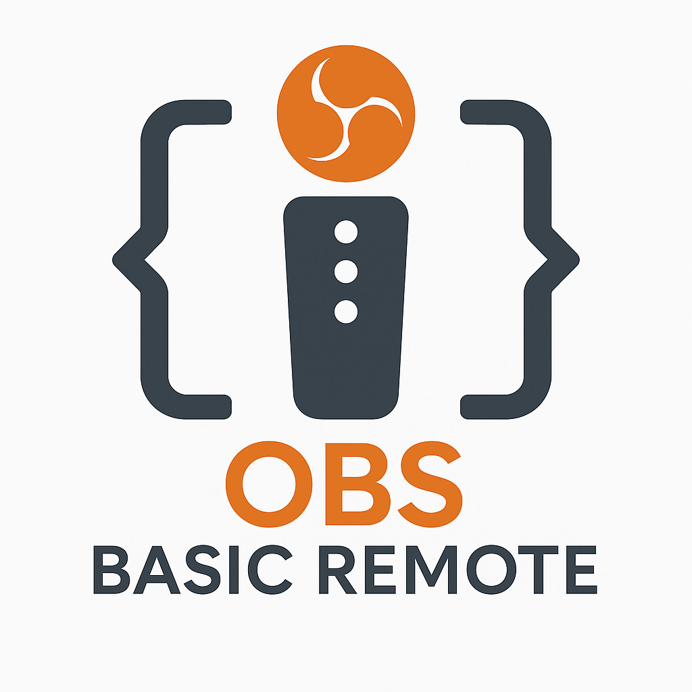

# Notes:  SMOKE BREAK

# UPLOADING FOR YOU 

# 🎮 GameHubLive Tools

A collection of lightweight, HTML+JS-based tools designed for streamers and live event hosts. These tools support OBS integration, tournament bracket management, and animated overlay generation — all offline-compatible and built with simplicity in mind.

## 📦 Included Tools

### 1. **OBS Basic Remote Control**
`basic-remote-control.html`  
Control OBS sources from a local HTML file via WebSocket.

- 🔒 Authenticated connection to OBS WebSocket (`ws://`)
- 🌛 Toggle visibility of scene items
- 🔁 Supports Studio Mode transitions
- ✅ No backend or install needed — just open in browser

**Note:** On secure browsers or mobile, you may need to download and open the file locally due to `ws://` limitations.

> 

---

### 2. **Color Cycle Frame Exporter**
`color-cycle-frames.html`  
Batch-process color-cycling animation frames from any image.

- 🎨 Apply hue rotation over multiple frames
- 🔁 Optional flip (horizontal/vertical) per frame
- 📁 Outputs frames as a downloadable ZIP
- 🧰 Useful for generating animated overlays or sprites

---

### 3. **Elimination Tournament Bracket Viewer**
`EliminationTournament.html`  
Interactive SVG bracket viewer with click-to-advance logic.

- 🧮 Supports 2, 4, 8, 16, or 32 player formats
- 🏆 Visual feedback for winners with glow effects
- ✍️ Enter names and determine winners client-side
- 🖥 Offline-compatible, ideal for local displays or kiosks

---

## 🚀 Getting Started

No build system or install needed. Just:

```bash

git clone https://github.com/CrandellWS/gamehublive-tools.git
cd gamehublive-tools
open basic-remote-control.html
```

Or open any `.html` file directly in your browser.

For full OBS remote functionality:

1. Enable WebSocket server in OBS.
2. Set a password in OBS settings.
3. Run `basic-remote-control.html` and connect.

---

## 🔐 Security Notes

If using from a secure `https://` page, most browsers **block **``** traffic**. Recommended:

- Open the tool as a **local file**
- Or self-host over plain HTTP if needed for LAN use

---

## 📄 License

This project is licensed under the MIT License. See [`LICENSE`](./LICENSE) for details.

---

## 🧠 Author

Created by [Bill Crandell](https://github.com/CrandellWS) — for streamers, devs, and chaos-friendly events.

